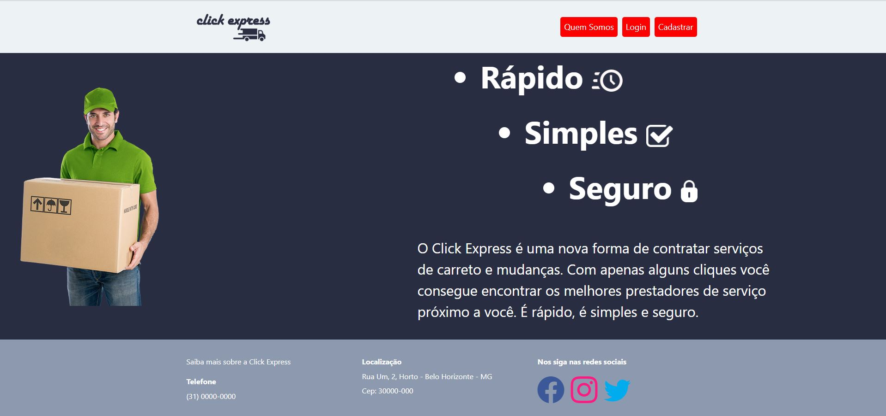

# ClickExpress

 
>Projeto desenvolvido no curso de Análise e Desenvolvimento de Sistemas - Eixo 2 da PUC MINAS, pelos integrantes Kênia Maria da Cunha, Sabrina Goncalves de Andrade, Thamara Machado Rocha e Werlon Elem Bicalho de Oliveira e sob orientação de Rosilane Mota.

O objetivo do projeto é a criação de uma aplicação, que proporcione uma melhor experiência e facilidade em encontrar pessoas que prestam os serviços de carreto e mudanças. 

# Apresentação

<li><a href="presentation/README.md"> Vídeo de apresentaçao da solução</a></li>

# Documentação

<ol>
<li><a href="docs/01-Documentação de Contexto.md"> Documentação de Contexto</a></li>
<li><a href="docs/02-Especificação do Projeto.md"> Especificação do Projeto</a></li>
<li><a href="docs/03-Metodologia.md"> Metodologia</a></li>
<li><a href="docs/04-Projeto de Interface.md"> Projeto de Interface</a></li>
<li><a href="docs/05-Arquitetura da Solução.md"> Arquitetura da Solução</a></li>
<li><a href="docs/06-Template Padrão da Aplicação.md"> Template Padrão da Aplicação</a></li>
<li><a href="docs/07-Programação de Funcionalidades.md"> Programação de Funcionalidades</a></li>
<li><a href="docs/08-Plano de Testes de Software.md"> Plano de Testes de Software</a></li>
<li><a href="docs/09-Registro de Testes de Software.md"> Registro de Testes de Software</a></li>
<li><a href="docs/10-Plano de Testes de Usabilidade.md"> Plano de Testes de Usabilidade</a></li>
<li><a href="docs/11-Registro de Testes de Usabilidade.md"> Registro de Testes de Usabilidade</a></li>
<li><a href="docs/12-Apresentação do Projeto.md"> Apresentação do Projeto</a></li>
<li><a href="docs/13-Referências.md"> Referências</a></li>
</ol>

